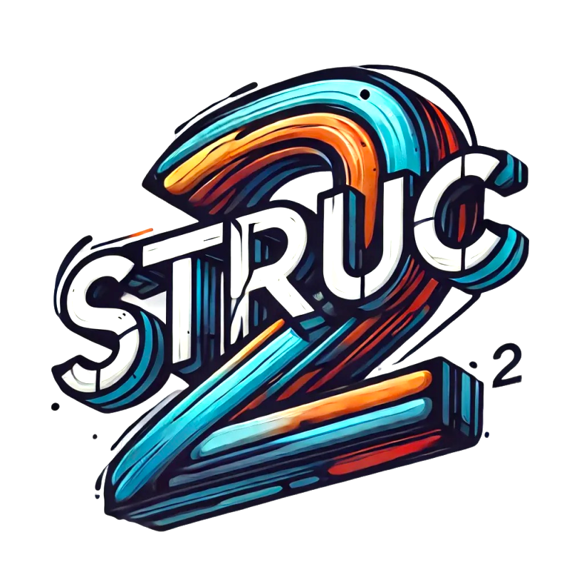

English | [中文](./README_CN.md)

<div align="center">
	
</div>

[](https://goreportcard.com/report/github.com/shengyanli1982/struc/v2)
[](https://github.com/shengyanli1982/struc/actions)
[](https://pkg.go.dev/github.com/shengyanli1982/struc/v2)
[](https://deepwiki.com/shengyanli1982/struc)

A high-performance Go library for binary data serialization with C-style struct definitions.

## Why struc v2?

- 🚀 **High Performance**: Optimized binary serialization with reflection caching
- 💡 **Simple API**: Intuitive struct tag-based configuration without boilerplate code
- 🛡️ **Type Safety**: Strong type checking with comprehensive error handling
- 🔄 **Flexible Encoding**: Support for both big and little endian byte orders
- 📦 **Rich Type Support**: Handles primitive types, arrays, slices, and custom padding
- 🎯 **Zero Dependencies**: Pure Go implementation with no external dependencies

## Installation

Requires Go 1.21+.

```bash
go get github.com/shengyanli1982/struc/v2
```

## Quick Start

```go
package main

import (
    "bytes"
    "github.com/shengyanli1982/struc/v2"
)

type Message struct {
    Size    int    `struc:"int32,sizeof=Payload"`  // Automatically tracks payload size
    Payload []byte                                 // Dynamic binary data
    Flags   uint16 `struc:"little"`               // Little-endian encoding
}

func main() {
    var buf bytes.Buffer

    // Pack data
    msg := &Message{
        Payload: []byte("Hello, World!"),
        Flags:   1234,
    }
    if err := struc.Pack(&buf, msg); err != nil {
        panic(err)
    }

    // Unpack data
    result := &Message{}
    if err := struc.Unpack(&buf, result); err != nil {
        panic(err)
    }
}
```

## Features

### 1. Rich Type Support

- Primitive types: `bool`, `int8`-`int64`, `uint8`-`uint64`, `float32`, `float64`
- Composite types: strings, byte slices, arrays
- Special types: padding bytes for alignment

### 2. Automatic Size Tracking

- Automatically manages lengths of variable-sized fields
- Eliminates manual size calculation and tracking
- Reduces potential errors in binary protocol implementations

### 3. Performance Optimizations

- Reflection caching for repeated operations
- Efficient memory allocation
- Optimized encoding/decoding paths

### 4. Smart Field Tags

```go
type Example struct {
    Length  int    `struc:"int32,sizeof=Data"`   // Size tracking
    Data    []byte                               // Dynamic data
    Version uint16 `struc:"little"`              // Endianness control
    Padding [4]byte `struc:"[4]pad"`            // Explicit padding
}
```

### 5. Struct Tag Reference

The `struc` tag supports various formats and options for precise binary data control:

#### Basic Type Definition

```go
type BasicTypes struct {
    Int8Val    int     `struc:"int8"`     // 8-bit integer
    Int16Val   int     `struc:"int16"`    // 16-bit integer
    Int32Val   int     `struc:"int32"`    // 32-bit integer
    Int64Val   int     `struc:"int64"`    // 64-bit integer
    UInt8Val   int     `struc:"uint8"`    // 8-bit unsigned integer
    UInt16Val  int     `struc:"uint16"`   // 16-bit unsigned integer
    UInt32Val  int     `struc:"uint32"`   // 32-bit unsigned integer
    UInt64Val  int     `struc:"uint64"`   // 64-bit unsigned integer
    BoolVal    bool    `struc:"bool"`     // Boolean value
    Float32Val float32 `struc:"float32"`  // 32-bit float
    Float64Val float64 `struc:"float64"`  // 64-bit float
}
```

#### Array and Fixed-Size Fields

```go
type ArrayTypes struct {
    // Fixed-size byte array (4 bytes)
    ByteArray   []byte    `struc:"[4]byte"`
    // Fixed-size integer array (5 int32 values)
    IntArray    []int32   `struc:"[5]int32"`
    // Padding bytes for alignment
    Padding     []byte    `struc:"[3]pad"`
    // Fixed-size string (treated as byte array)
    FixedString string    `struc:"[8]byte"`
}
```

#### Dynamic Size and References

```go
type DynamicTypes struct {
    // Size field tracking the length of Data
    Size     int    `struc:"int32,sizeof=Data"`
    // Dynamic byte slice whose size is tracked by Size
    Data     []byte
    // Size field using uint8 to track AnotherData
    Size2    int    `struc:"uint8,sizeof=AnotherData"`
    // Another dynamic data field
    AnotherData []byte
    // Dynamic string field with size reference
    StrSize  int    `struc:"uint16,sizeof=Text"`
    Text     string `struc:"[]byte"`
}
```

#### Byte Order Control

```go
type ByteOrderTypes struct {
    // Big-endian encoded integer
    BigInt    int32  `struc:"big"`
    // Little-endian encoded integer
    LittleInt int32  `struc:"little"`
    // Default to big-endian if not specified
    DefaultInt int32
}
```

#### Special Options

```go
type SpecialTypes struct {
    // Ignore this field during packing/unpacking (not included in the binary layout)
    Ignored  int    `struc:"skip"`
    // Alias of `skip` (ignore this field entirely)
    Private  string `struc:"-"`
    // Size reference from another field
    Data     []byte `struc:"sizefrom=Size"`
    // Custom type implementation (a concrete type that implements CustomBinaryer)
    YourCustomType   MyCustomType
}
```

Tag Format: `struc:"type,option1,option2"`

- `type`: The binary type (e.g., int8, uint16, [4]byte)
- `big`/`little`: Byte order specification
- `sizeof=Field`: Specify this field tracks another field's size
- `sizefrom=Field`: Specify this field's size is tracked by another field
- `skip`: Ignore this field during packing/unpacking (no bytes are written/read). If you need to reserve bytes, use `[N]pad`.
- `-`: Alias of `skip` (ignore this field entirely)
- `[N]type`: Fixed-size array of type with length N
- `[]type`: Dynamic-size array/slice of type (must have a length source via `sizeof` or `sizefrom`)

**Important notes**

- For `string` fields, always specify the length explicitly using `[N]byte` (fixed length) or `[]byte` together with `sizeof`/`sizefrom` (dynamic length). Otherwise, `Unpack` will treat it as 1 byte.

#### Why `omitempty` is not supported?

Unlike JSON serialization where fields can be optionally omitted, binary serialization requires a strict and fixed byte layout. Here's why `omitempty` is not supported:

1. **Fixed Binary Layout**
    - Binary protocols require precise byte positioning
    - Each field must occupy its predefined position and size
    - Omitting fields would break the byte alignment

2. **Parsing Dependencies**
    - Binary data is parsed sequentially, byte by byte
    - If fields are omitted, the byte stream becomes misaligned
    - The receiving end cannot correctly reconstruct the data structure

3. **Protocol Stability**
    - Binary protocols need strict version control
    - Allowing optional fields would break protocol stability
    - Makes it impossible to maintain backward compatibility

4. **Debugging Complexity**
    - With omitted fields, binary data becomes unpredictable
    - Makes it extremely difficult to debug byte streams
    - Increases the complexity of troubleshooting

If you need to mark certain fields as optional, consider these alternatives:

- Use explicit flag fields to indicate validity
- Use default values for optional fields
- Use the `struc:"-"` tag to completely exclude fields from serialization

## Advanced Usage

### Custom Type Implementation

If you need complete control over how a type is serialized and deserialized in binary format, you can implement the `CustomBinaryer` interface:

```go
type CustomBinaryer interface {
    // Pack serializes data into a byte slice
    Pack(p []byte, opt *Options) (int, error)

    // Unpack deserializes data from a Reader
    Unpack(r io.Reader, length int, opt *Options) error

    // Size returns the size of serialized data
    Size(opt *Options) int

    // String returns the string representation of the type
    String() string
}
```

For example, implementing a 3-byte integer type:

```go
// Usage example
type Message struct {
    Value Int3 // Custom type (a concrete type that implements CustomBinaryer)
}

// Int3 is a custom 3-byte integer type
type Int3 uint32

func (i *Int3) Pack(p []byte, opt *Options) (int, error) {
    // Convert 4-byte integer to 3 bytes
    var tmp [4]byte
    binary.BigEndian.PutUint32(tmp[:], uint32(*i))
    copy(p, tmp[1:]) // Only copy the last 3 bytes
    return 3, nil
}

func (i *Int3) Unpack(r io.Reader, length int, opt *Options) error {
    var tmp [4]byte
    if _, err := r.Read(tmp[1:]); err != nil {
        return err
    }
    *i = Int3(binary.BigEndian.Uint32(tmp[:]))
    return nil
}

func (i *Int3) Size(opt *Options) int {
    return 3 // Fixed 3-byte size
}

func (i *Int3) String() string {
    return strconv.FormatUint(uint64(*i), 10)
}
```

Benefits of custom types:

- Complete control over binary format
- Support for special data layouts
- Ability to implement compression or encryption
- Suitable for handling legacy system formats

## Best Practices

1. **Use Appropriate Types**
    - Match Go types with their binary protocol counterparts
    - Use fixed-size arrays when the size is known
    - Use slices with `sizeof` for dynamic data

2. **Error Handling**
    - Always check returned errors from Pack/Unpack
    - Validate data sizes before processing

3. **Performance Optimization**
    - Reuse structs when possible
    - Consider using pools for frequently used structures

4. **Memory Management**
    - When packing, the library pre-allocates a buffer with the exact size needed for the data

        ```go
        bufferSize := packer.Sizeof(value, options)
        buffer := make([]byte, bufferSize)
        ```

    - For unpacking, the library uses internal scratch arenas (default 4KiB) and a shared slice pool (default 4KiB) to reduce allocations
    - Only `string` fields and non-array `[]byte` fields may directly reference internal buffers (zero-copy)
    - If a single field needs more than 4KiB, a dedicated slice will be allocated for that field
    - These internal buffers will remain in memory as long as your struct fields reference them

        ```go
        type Message struct {
            Data []byte    // This field will reference the internal buffer
        }

        func processRetain() {
            messages := make([]*Message, 0)

            // >> Important:
            // The Field struct is just a metadata description object
            // Its lifecycle end does not affect user struct fields that have been set via unsafe operations
            // Because unsafe operations have directly modified the underlying pointer of user struct fields to point to the 4K buffer
            // >> Therefore:
            // Releasing the Field struct will not cause the slice references on the 4K buffer to disappear
            // These references only disappear when the user structs using these slices are GC'ed
            // The 4K buffer's lifecycle depends on the lifecycle of all user structs referencing it

            // Each unpacked message's Data field references the internal buffer
            for i := 0; i < 10; i++ {
                msg := &Message{}
                // During unpacking:
                // 1. unpackBasicTypeSlicePool provides 4K buffer
                // 2. Field struct handles metadata
                // 3. unsafe operations point msg.Data to part of 4K buffer
                struc.Unpack(reader, msg)
                // Even if Field struct is released now
                // msg.Data still points to 4K buffer
                // Only when msg is GC'ed will this reference disappear
                messages = append(messages, msg)
                // Internal buffer can't be GC'ed because msg.Data references it
                // Field struct's lifecycle is irrelevant to 4K buffer references
                // 4K buffer references are held by user structs
                // Only when all user structs referencing this 4K buffer are GC'ed can the buffer be collected
            }
        }
        ```

    - To release the internal buffer reference, you can either set the field to nil or copy the data:

        ```go
        func processRelease() {
            msg := &Message{}
            struc.Unpack(reader, msg)

            // Method 1: Simply set to nil if you don't need the data anymore
            msg.Data = nil  // Now msg.Data is nil, no longer references the internal buffer

            // Method 2: Copy data if you need to keep it
            if needData {
                dataCopy := make([]byte, len(msg.Data))
                copy(dataCopy, msg.Data)
                msg.Data = dataCopy  // Now msg.Data references our copy
            }

            // The internal buffer can now be GC'ed if no other structs reference it
        }
        ```

## Performance Benchmarks

```bash
$ go.exe test -benchmem -run=^$ -bench . github.com/shengyanli1982/struc/v2
Starting pprof server on :6060
goos: windows
goarch: amd64
pkg: github.com/shengyanli1982/struc/v2
cpu: 12th Gen Intel(R) Core(TM) i5-12400F
BenchmarkArrayEncode-12          9571850               122.3 ns/op           112 B/op          2 allocs/op
BenchmarkSliceEncode-12          9085725               132.1 ns/op           112 B/op          2 allocs/op
BenchmarkArrayDecode-12         13183407                91.15 ns/op           49 B/op          1 allocs/op
BenchmarkSliceDecode-12          7815796               155.2 ns/op            89 B/op          3 allocs/op
BenchmarkEncode-12               5601387               218.0 ns/op             0 B/op          0 allocs/op
BenchmarkStdlibEncode-12        11315949               105.1 ns/op            24 B/op          1 allocs/op
BenchmarkManualEncode-12        51424236                22.79 ns/op           64 B/op          1 allocs/op
BenchmarkDecode-12               5165126               233.2 ns/op             8 B/op          0 allocs/op
BenchmarkStdlibDecode-12         7359375               163.7 ns/op            32 B/op          2 allocs/op
BenchmarkManualDecode-12        100000000               10.91 ns/op            8 B/op          1 allocs/op
BenchmarkFullEncode-12            761937              1518 ns/op               0 B/op          0 allocs/op
BenchmarkFullDecode-12            765120              1538 ns/op             125 B/op          3 allocs/op
BenchmarkFieldPool-12           11439705               105.7 ns/op             0 B/op          0 allocs/op
BenchmarkGetFormatString/Simple-12              11294882               105.1 ns/op             5 B/op          1 allocs/op
BenchmarkGetFormatString/Complex-12              6519446               185.6 ns/op            16 B/op          1 allocs/op
```

## License

MIT License - see LICENSE file for details
